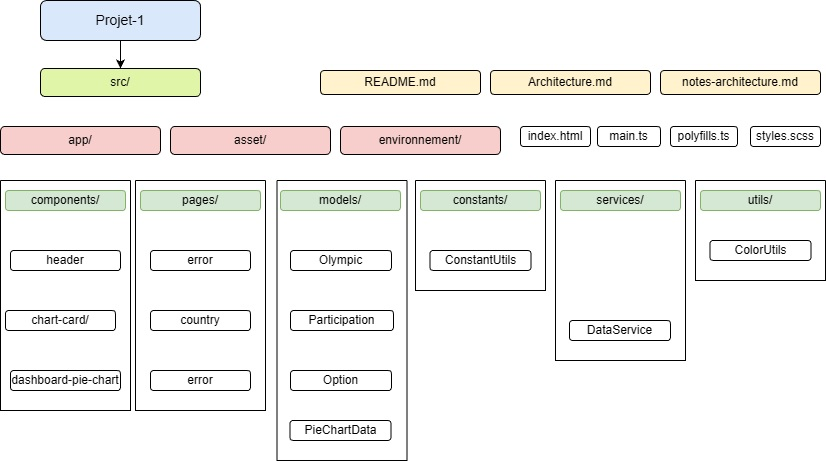

### Problèmes majeurs de structure
#### 1. Architecture monolithique des composants
**Description :**
Les composants (`HomeComponent`, `CountryComponent`) importent directement les données et contiennent toute la logique de traitement (récupération, transformation, affichage).
**Impact :**
- Couplage fort entre la vue et la logique métier.
- Absence de séparation des responsabilités.
- Code dupliqué et non réutilisable.
**Priorité :** Haute

---
#### 2. Centralisation de l’intelligence dans deux pages
**Description :**
Toute la logique applicative est concentrée dans deux composants, sans modularité ni découpage en services ou composants spécialisés.
**Impact :**
- Violation du principe de responsabilité unique (SRP).
- Difficulté d’évolution et de maintenance.
**Priorité :** Haute

---
#### 3. Gestion non robuste des dépendances externes (Chart.js)
**Description :**
Initialisation de Chart.js via des IDs de canvas en dur (`new Chart("DashboardPieChart", ...)`), rendant le code dépendant du DOM et peu flexible.

`HomeComponent` ligne 42.

**Impact :**
- Fragilité face aux modifications du template HTML.
- Logique d’affichage mélangée à la logique métier.
**Priorité :** Moyenne

---
#### 4. Fuites mémoire liées aux subscriptions non nettoyées
**Description :**
Les abonnements aux observables (ex: `this.route.paramMap.subscribe`) ne sont pas désabonnés, entraînant des fuites mémoire lors de la navigation.
**Impact :**
- Accumulation de références inutiles et dégradation des performances.
- Risque de comportement imprévisible (traitement de données obsolètes).
**Priorité :** Haute

---
#### 5. Absence de mécanismes de partage de logique
**Description :**
Aucun service ou utilitaire n’est utilisé pour mutualiser le code commun entre les composants.
**Impact :**
- Redondance et duplication de code.
- Maintenance complexe (modifications à répliquer manuellement).
**Priorité :** Haute

---
### Problèmes de duplication
#### 1. Chargement et parsing redondants des données
**Description :**
Les composants `HomeComponent` et `CountryComponent` chargent et analysent les mêmes données JSON depuis la même URL (`./assets/mock/olympic.json`). La logique de mapping et d’agrégation des données est répétée dans les deux composants.

`HomeComponent` ligne 22 et `CountryComponent` ligne 27

**Impact :**
- Redondance dans le code source.
- Risque d’incohérence si une modification est apportée à un seul endroit.
- Maintenance difficile : toute mise à jour de la structure des données ou de la logique de traitement doit être effectuée en double.
**Priorité :** Haute

---
#### 2. Duplication des calculs utilitaires
**Description :**
Les calculs utilitaires, comme la somme des médailles ou l’extraction des années, sont réimplémentés dans plusieurs composants.

`HomeComponent` ligne 26 à 31 et `CountryComponent` ligne 32 à 38

**Impact :**
- Perte de temps lors des modifications ou corrections.
- Risque d’erreurs si les logiques divergent entre les composants.
**Priorité :** Moyenne

---
#### 3. URL de ressource codée en dur
**Description :**
L’URL de la ressource (`private olympicUrl = './assets/mock/olympic.json'`) est définie en dur dans plusieurs composants.

`HomeComponent` ligne 13 et `CountryComponent` ligne 12

**Impact :**
- Difficulté de maintenance : une modification de l’URL nécessite une mise à jour manuelle dans chaque composant.
- Violation du principe DRY (Don’t Repeat Yourself), ce qui rend le code moins robuste et plus sujet aux erreurs.
**Priorité :** Moyenne

---
### Problèmes de typage
#### 1. Usage excessif du type `any`
**Description :**
Le code utilise massivement le type `any` dans les appels HTTP (`http.get<any[]>`), les boucles (`i: any`), et les propriétés (`selectedCountry: any`).
**Impact :**
- Perte des avantages de TypeScript : absence de vérification de type à la compilation.
- Risque accru d’erreurs à l’exécution (ex : accès à des propriétés inexistantes).
- Maintenance compliquée : impossibilité de connaître la structure attendue des données.
**Priorité :** Haute

---
#### 2. Conversions maladroites entre `string` et `number`
**Description :**
Des conversions inutiles ou incorrectes sont présentes, comme la transformation de `medalsCount` en `string` puis son parsing en `number` pour effectuer des calculs.
`CountryComponent` ligne 35 et 36
**Impact :**
- Logique confuse et peu intuitive.
- Signe d’un typage initial défaillant : les données sources ne sont pas correctement typées dès leur récupération.
- Risque de bugs liés aux conversions implicites ou aux erreurs de parsing.
**Priorité :** Moyenne

---
### Problèmes de placement et de séparation des responsabilités
#### 1. Appels HTTP directement dans les composants
**Description :**
Les composants effectuent eux-mêmes les appels HTTP (ex: `http.get`), ce qui viole le principe de responsabilité unique (SRP).
**Impact :**
- Couplage fort entre la logique métier, la récupération des données et l’interface utilisateur.
- Difficulté à tester les composants isolément.
- Code moins réutilisable et plus difficile à maintenir.
**Priorité :** Haute

---
#### 2. URL de ressource codée en dur
**Description :**
L’URL de la ressource (`private olympicUrl = './assets/mock/olympic.json'`) est définie directement dans les composants.
**Impact :**
- Duplication et risque d’incohérence si l’URL change.
- Violation du principe DRY et difficulté de maintenance.
**Priorité :** Moyenne

---
#### 3. Mélange de l’UI et de la logique métier
**Description :**
Les composants contiennent à la fois la logique d’affichage et des traitements lourds (calculs de sommes, transformations de données).
**Impact :**
- Composants surchargés et difficiles à comprendre.
- Manque de modularité : impossibilité de réutiliser la logique métier ailleurs.
- Tests unitaires plus complexes à mettre en place.
**Priorité :** Haute

---
### Problèmes de qualité
#### 1. Présence de `console.log` en production
**Description :**
Des instructions de débogage (`console.log`) sont laissées dans le code final (`HomeComponent`), ce qui est inadapté pour un environnement de production.
**Impact :**
- Pollution de la console pour les utilisateurs finaux.
- Risque de fuite d’informations sensibles ou techniques.
- Manque de professionnalisme dans le code livré.
**Priorité :** Basse

---
#### 2. Gestion des erreurs limitée
**Description :**
La gestion des erreurs se limite à l’affichage basique de `error.message`, sans interface utilisateur dédiée ni mécanisme de reprise.
**Impact :**
- Expérience utilisateur dégradée en cas d’erreur (messages techniques bruts).
- Absence de résilience : l’application ne propose pas de solution alternative (ex : réessayer, message clair, état de repli).
- Difficulté à diagnostiquer les problèmes en production.
**Priorité :** Moyenne

### Arborescence du projet souhaité
Voici ce que doit être la structure des dossiers et fichiers du projet :

*Source : ArborescencesP1.jpg*

Pour plus de détails sur l'architecture, voir le document :
[Architecture du projet](./Architecture.md).

